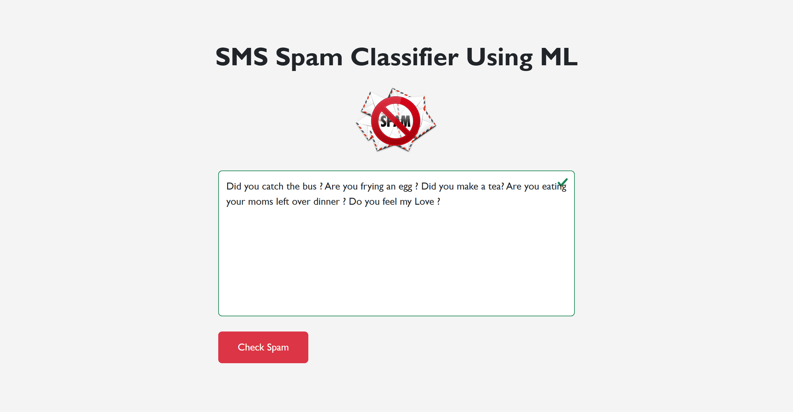

# SMS Spam Classifier Using Machine Learning

# Guide:

* Step 1. Download `Python 3.13.2` or lates version and Install it if doesn't exist on your system.

* Step 2. Clone the project.

* Step 3. Open CMD or PowerShell and navigate to the project folder, Type `pip install -r requirements.txt` to download and install the project Packages.

* Step 4. Type `python app.py` in CMD or PowerShell to run the project.

* Step 5. Open your browser and type `http://127.0.0.1:5000/` to view the project.

Enjoy the project!
